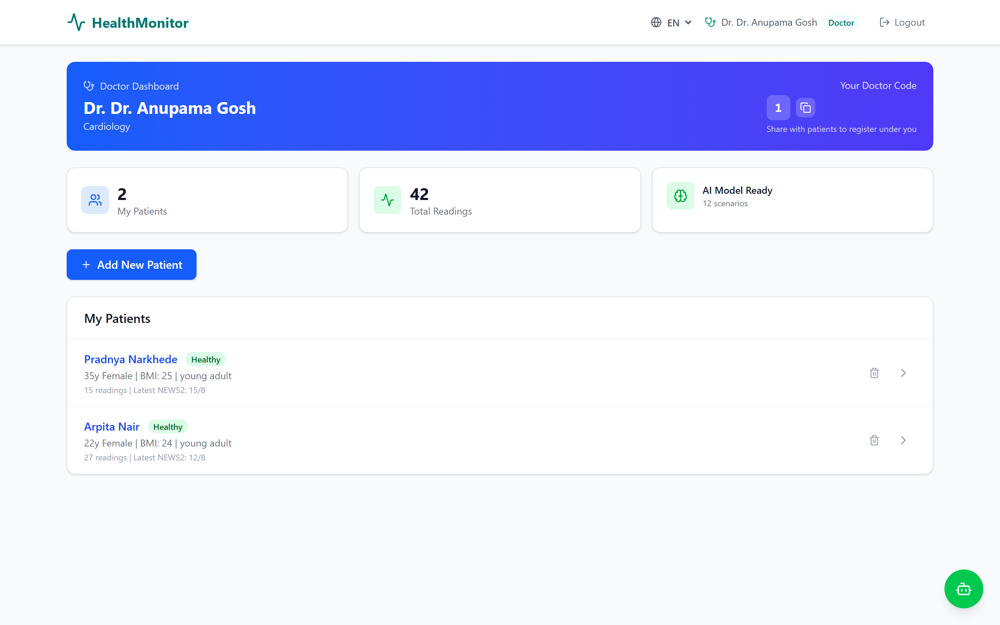
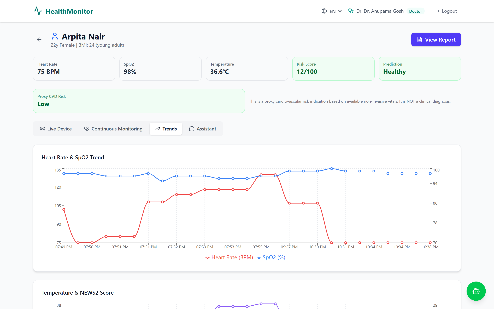
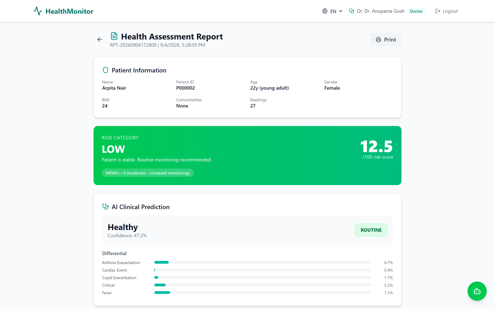
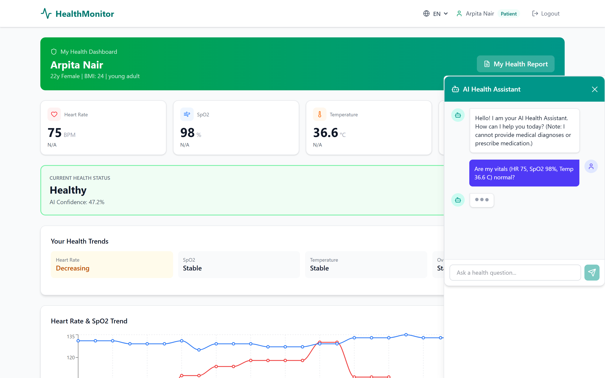

<div align="center">
  

  # 🏥 AI-Powered Smart Health Monitoring System
  
  **Real-Time Vitals Tracking • Predictive Analytics • AI Medical Chatbot**

  [](https://reactjs.org/)
  [](https://vitejs.dev/)
  [](https://flask.palletsprojects.com/)
  [](https://python.org)
  [](https://deepmind.google/technologies/gemini/)

</div>

<br />

> 🚀 **The Future of Proactive Healthcare**: An intelligent, full-stack application that not only monitors patient vitals (Heart Rate, SpO2, Temperature) in real-time but leverages Machine Learning to predict health deterioration before it happens, complemented by an interactive AI assistant.

---

## ✨ Key Features

### 🧑‍⚕️ For Doctors
* **Patient Management:** View a comprehensive list of all assigned patients.
* **Predictive Analytics:** Early-warning AI models (Gradient Boosting & Random Forest) that flag patients at high risk of clinical deterioration.
* **Trend Analysis:** Automated temporal tracking of vitals to spot dangerous patterns over time.
* **Instant Reports:** One-click automated clinical reports summarizing vitals and AI predictions.

### 🤒 For Patients
* **Live Vitals Dashboard:** Real-time updates of Heart Rate, SpO2, and Temperature via connected IoT devices.
* **Personalized Health Insights:** Easy-to-understand breakdown of current health status based on historical data.
* **Multilingual AI Health Assistant:** Ask health-related questions and get personalized, conservative medical guidance in English, Hindi, or Marathi based on your actual live vitals.

---

## 📸 Interactive Previews

> 💡 *Note: The placeholder images below should be replaced with actual screenshots of the application running.*

<br/>

### 1️⃣ Intelligent Doctor Dashboard
Overview of all patients with AI-powered Risk Scores instantly visible.
<div align="center">
  
</div>

<br/>

### 2️⃣ Patient Detail & Live Monitoring
Real-time graphs charting Heart Rate, Blood Oxygen (SpO2), and Body Temperature.
<div align="center">
  
</div>

<br/>

### 3️⃣ AI Predictive Reports
Automated generation of PDF-style diagnostic reports leveraging our custom ML Pipeline.
<div align="center">
  
</div>

<br/>

### 4️⃣ Floating AI Health Assistant (Chatbot)
An eye-catching, bottom-right contextual chatbot powered by Google Gemini, capable of giving health insights based on the patient's *exact live vitals*.
<div align="center">
  
</div>

---

## 🧠 Technology Stack

### 🖥️ Frontend (Client)
- **React.js 19** + **Vite**: Blazing fast UI development.
- **TailwindCSS 4**: Sleek, modern utility-first styling with custom glassmorphism effects.
- **Recharts**: Smooth, interactive temporal graphing of patient vitals.
- **Lucide React**: Beautiful, consistent iconography.

### ⚙️ Backend (API & ML)
- **Python / Flask**: Lightweight, highly performant RESTful API.
- **Scikit-Learn & Pandas**: Custom ML pipeline for Early Warning Scores and CVD Risk Assessment.
- **Google Generative AI (Gemini)**: Context-aware conversational AI engine.
- **SQLite**: Fast, localized relational database management.

---

## 🏗️ System Architecture

The system is designed with a decoupled client-server architecture to ensure scalability and real-time responsiveness:

1. **IoT / Hardware Layer**: Sensors collect live physiological data (Heart Rate, SpO2, Temperature) and transmit it via Wi-Fi/ESP32 directly to the backend API.
2. **Backend API Layer (Flask)**: Processes incoming sensor data, authenticates users (JWT/session), and stores time-series vitals in SQLite. 
3. **Machine Learning Pipeline**: The backend runs the data through a pre-trained Scikit-Learn model (`MODEL3.py`) to generate instant clinical predictions (e.g., 'Normal', 'Elevated Risk', 'Critical'). It also computes temporal baseline deviations.
4. **AI Context Engine**: The Google Gemini API is injected with the patient's specific history and recent vitals, acting as a specialized medical reasoning engine for the chatbot.
5. **Frontend Client (React)**: Fetches and visualizes the data through interactive Recharts graphs, rendering conditional UI based on whether the user is a Patient or a Doctor.

---

## ⚙️ How It Works (Core Functioning)

* **Data Acquisition**: Live vitals are recorded and instantly sent to the `/api/patients/{id}/vitals` endpoint.
* **Risk Stratification**: Upon receiving data, the custom ML model evaluates the reading against a dataset of clinical scenarios, returning a confidence score and a classification label.
* **Trend Analysis**: The system analyzes the last 50 readings to detect subtle deteriorations (e.g., a slow, continuous drop in SpO2 over 4 hours) that a human might miss.
* **Interactive AI Guidance**: When a patient asks the Chatbot a question, the backend intercepts the query, packages it seamlessly with the patient's age, BMI, comorbidities, and the trend analysis, and sends it to Gemini. Gemini then replies with highly contextual, personalized advice without requiring the patient to explain their current health state.

---

## 🚀 Getting Started

Follow these steps to run the project locally on your machine.

### 1. Clone the repository
```bash
git clone https://github.com/divyani-22/Cep-project.git
cd Cep-project
```

### 2. Setup the Backend (Python / Flask)
```bash
cd backend

# Create a virtual environment (optional but recommended)
python -m venv venv
venv\Scripts\activate  # Windows
# source venv/bin/activate  # Mac/Linux

# Install dependencies
pip install -r requirements.txt

# Start the Flask API server
python app.py
```
*The backend will run on `http://localhost:5000`*

### 3. Setup the Frontend (React / Vite)
Open a new terminal window:
```bash
cd frontend

# Install Node dependencies
npm install

# Start the development server
npm run dev
```
*The frontend will run on `http://localhost:5173`*

### 4. Configuration
Ensure you have a `.env` file in the `backend/` directory with your Google Gemini API key:
```env
GEMINI_API_KEY=your_actual_api_key_here
```

---

<div align="center">
  <b>Built with ❤️ for the future of healthcare.</b>
</div>
